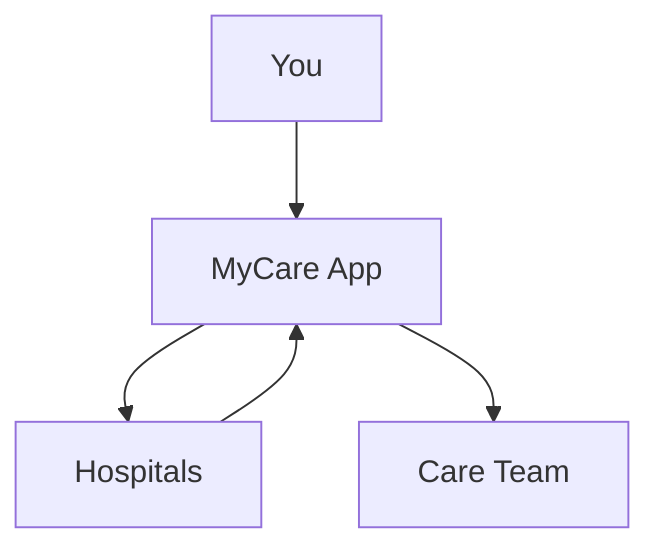

## Overview

MyCare empowers you to take control of your health journey. Track vital signs between doctor visits, enroll in specialized care programs, connect with a supportive community for emergency assistance, and securely manage your medical records across hospitals. This unified platform ensures your data stays patient-controlled while enabling seamless sharing with care teams.

## Key Features

Discover the core capabilities through these highlighted features.

<Columns cols={2}>
  <Card title="Vital Tracking" icon="activity" href="#track-vitals">
    Monitor heart rate, blood pressure, and more in real-time.
  </Card>
  <Card title="Care Programs" icon="award" href="#care-programs">
    Access tailored health initiatives and resources.
  </Card>
  <Card title="Community Support" icon="users" href="#community-support">
    Get help with emergency bills and peer encouragement.
  </Card>
  <Card title="Data Management" icon="database" href="#data-management">
    Share records securely across providers.
  </Card>
</Columns>

## Track Your Vitals

Regular self-monitoring keeps you proactive about your health. Use the MyCare app to log metrics like blood pressure, heart rate, and steps daily.

<Steps>
  <Step title="Open App" icon="smartphone">
    Launch MyCare on your mobile device.
  </Step>
  <Step title="Select Metrics" icon="activity">
    Choose from vitals such as `<120/80` blood pressure or `>70 bpm` heart rate.
  </Step>
  <Step title="Log Data" icon="plus">
    Enter values manually or sync from wearables.
  </Step>
  <Step title="Review Trends" icon="trending-up">
    View charts and set alerts for anomalies.
  </Step>
</Steps>

<Callout kind="tip">
  Sync with devices like Fitbit or Apple Health for automatic data import.
</Callout>

## Access Care Programs

MyCare connects you to specialized programs for chronic conditions or wellness goals.

<Tabs>
  <Tab title="Diabetes Management" icon="shield">
    Track glucose levels and access nutrition plans.
  </Tab>
  <Tab title="Mental Health" icon="heart">
    Join therapy sessions and mood journaling tools.
  </Tab>
  <Tab title="Cardiac Care" icon="zap">
    Monitor ECG and receive rehab exercises.
  </Tab>
</Tabs>

## Community Support

When facing unexpected bills, tap into peer-to-peer aid.

<Expandable title="How to Request Emergency Aid" default-open="true">
  Post your needs in the community forum. Members vote and contribute via secure donations. MyCare handles verification to prevent fraud.
</Expandable>

## Manage and Share Medical Data

Centralize records from multiple hospitals and share selectively.



Integrate via API for advanced sharing.

<CodeGroup tabs="JavaScript,Python">
  ```javascript
  const mycare = require('mycare-sdk');
  const client = new mycare.Client({ apiKey: `YOUR_API_KEY` });

  async function shareVitals(patientId, vitals) {
    const response = await client.post(`/patients/${patientId}/vitals`, vitals);
    console.log('Shared:', response.data);
  }
  ```
  ```python
  import mycare

  client = mycare.Client(api_key="YOUR_API_KEY")

  def share_vitals(patient_id, vitals):
      response = client.post(f"/patients/{patient_id}/vitals", vitals)
      print("Shared:", response.data)
  ```
</CodeGroup>

<Request tabs="JavaScript,cURL" show-lines="true">
  ```javascript
  const response = await fetch('https://api.example.com/v1/patients/123/vitals', {
    method: 'POST',
    headers: { 'Authorization': 'Bearer YOUR_TOKEN', 'Content-Type': 'application/json' },
    body: JSON.stringify({ heartRate: 72, bloodPressure: '120/80' })
  });
  ```
  ```bash
  curl -X POST https://api.example.com/v1/patients/123/vitals \
    -H "Authorization: Bearer YOUR_TOKEN" \
    -H "Content-Type: application/json" \
    -d '{"heartRate":72,"bloodPressure":"120/80"}'
  ```
</Request>

<Response tabs="200">
  ```json
  {
    "id": "vit-456",
    "patientId": "123",
    "heartRate": 72,
    "bloodPressure": "120/80",
    "timestamp": "2024-01-15T10:30:00Z"
  }
  ```
</Response>

<ParamField path="patientId" param-type="string" required="true">
  Your unique patient identifier from MyCare.
</ParamField>

<ParamField body="heartRate" param-type="number" required="false">
  Current heart rate in beats per minute.
</ParamField>

This setup ensures `<100ms` response times and HIPAA-compliant security. Start by [linking to quickstart](/quickstart) for setup.