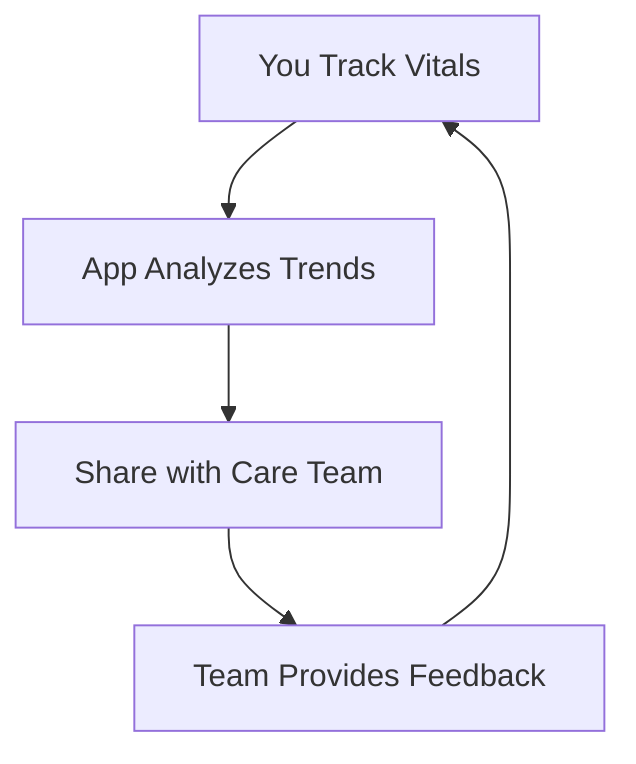

## Overview

MyCare bridges the gap between self-care and clinical care. You track your vitals, join special care programs, and receive community support for emergency needs—all in one patient-controlled platform. Manage your medical information across hospitals, self-monitor between visits, and share data securely with your care team.

## Key Features

MyCare offers powerful tools to put you in control of your health journey.

<Columns cols={3}>
  <Card title="Vital Tracking" icon="activity" href="#vital-tracking">
    Log blood pressure, heart rate, and glucose levels daily. View trends and get insights.
  </Card>
  <Card title="Care Programs" icon="stethoscope" href="#care-programs">
    Access personalized programs for chronic conditions like diabetes or hypertension.
  </Card>
  <Card title="Community Support" icon="users" href="#community">
    Get help with emergency bills and connect with peers facing similar challenges.
  </Card>
  <Card title="Secure Sharing" icon="shield" href="#sharing" horizontal>
    Share records with doctors across providers. You control access anytime.
  </Card>
</Columns>

## How MyCare Works

This simple loop keeps you proactive while staying connected to professionals.

<Callout kind="info">
  MyCare uses end-to-end encryption for all data. Your information remains private and accessible only to authorized parties.
</Callout>

## Quick Start

Get up and running in minutes.

<Tabs>
  <Tab title="iOS" icon="apple">
    Download from the App Store and create your account.
  </Tab>
  <Tab title="Android" icon="android" >
    Install via Google Play. Grant health permissions for accurate tracking.
  </Tab>
  <Tab title="Web" icon="globe">
    Visit `https://app.mycare.com` in your browser. No download needed.
  </Tab>
</Tabs>

<Steps>
  <Step title="Sign Up" icon="user-plus">
    Enter your email and set a strong password. Verify via SMS.
  </Step>
  <Step title="Track First Vital" icon="heart-pulse">
    Open the app, select "Blood Pressure", and log your reading.
  </Step>
  <Step title="Connect Providers" icon="link">
    Add your doctor's details to enable secure sharing.
  </Step>
</Steps>

## Benefits for You

- **Unified Records**: Consolidate data from multiple hospitals in one place.
- **Proactive Monitoring**: Spot issues early with trend alerts.
- **Empowered Sharing**: Grant temporary access without losing control.
- **Community Aid**: Crowdfund emergencies through trusted networks.

<Callout kind="tip">
  Consult your doctor before relying on self-tracked data for decisions. MyCare complements, not replaces, professional care.
</Callout>

## Next Steps

<Columns cols={2}>
  <Card title="Quickstart Guide" icon="rocket" href="/quickstart">
    Dive into full setup and first measurements.
  </Card>
  <Card title="Authentication" icon="lock" href="/authentication">
    Secure your account with advanced options.
  </Card>
  <Card title="API Integration" icon="code" href="/api">
    Connect MyCare data to your custom apps.
  </Card>
  <Card title="Help Center" icon="help-circle" href="/help-center">
    FAQs and troubleshooting.
  </Card>
</Columns>